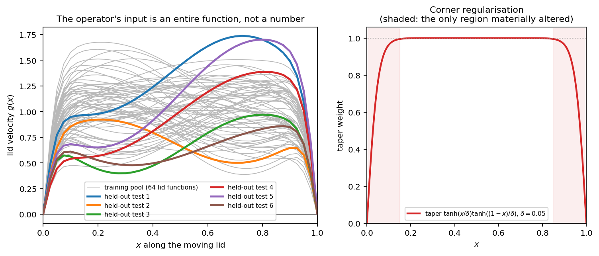
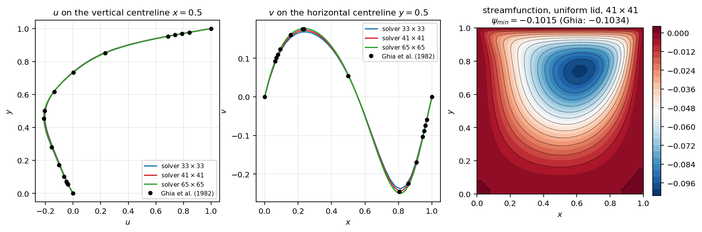
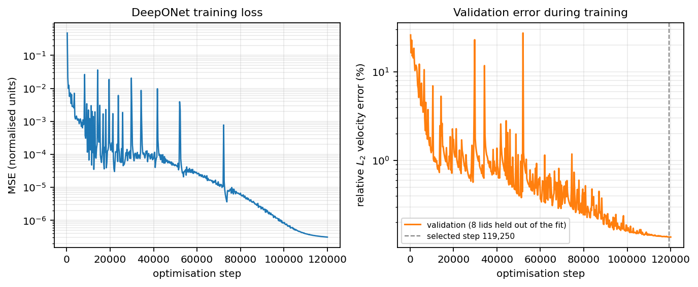
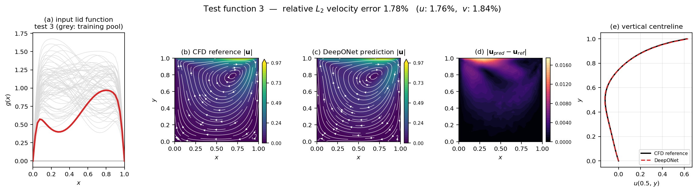
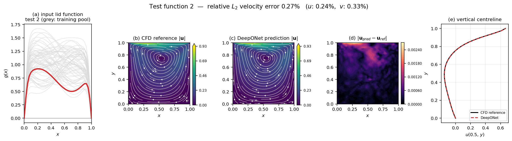
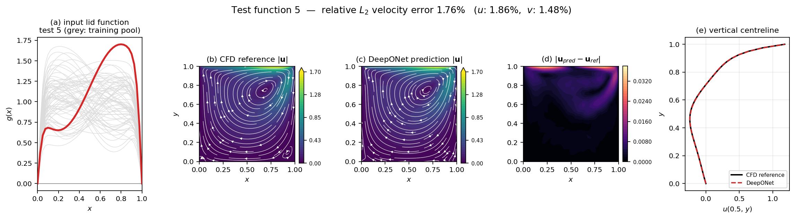
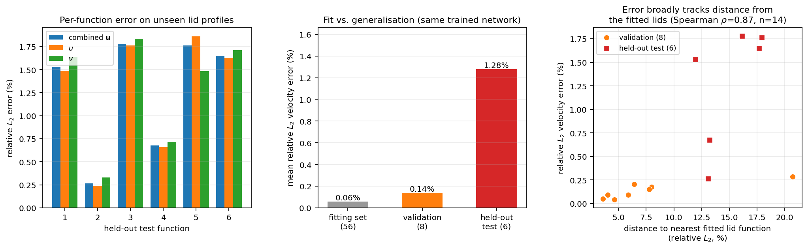
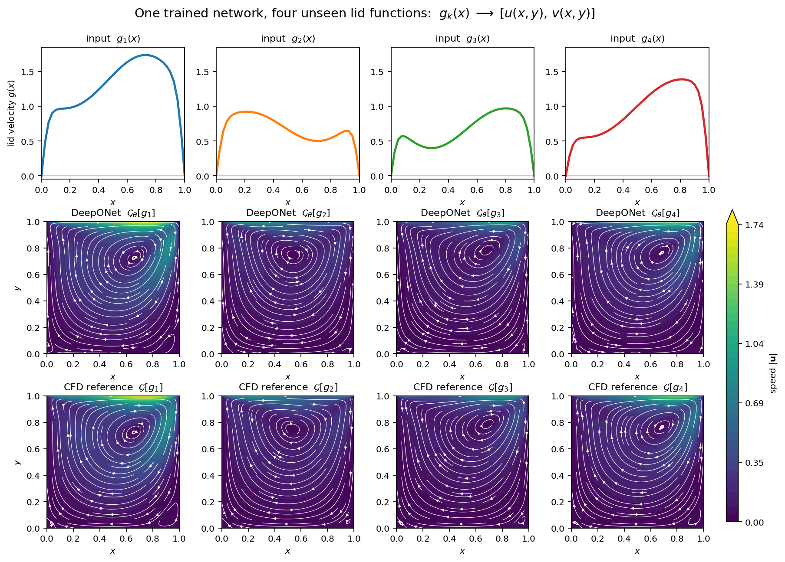

Building a Simple Neural Operator Experiment
============================================

So far the argument has been made mostly in symbols. We said that a neural
operator learns a map between *function spaces*, and the example we used was
the integration operator

$$
\mathcal{I}[f](x) = \int_0^x f(s)\, ds ,
\qquad\text{that is,}\qquad
f(x) \;\overset{\mathcal{I}}{\longrightarrow}\; u(x).
$$

You hand $\mathcal{I}$ an entire function $f$ and it hands back an entire
function $u$. Change $f$ and you get a different $u$. Nothing here is a number
being mapped to a number; the *input itself is a curve*.

That example is clean because we can write $\mathcal{I}$ down in closed form.
The interesting claim is that the same picture applies when the operator is
something we *cannot* write down — for instance, the map from a boundary
condition to the solution of the Navier–Stokes equations. That is what this
experiment builds:

$$
g(x) \;\overset{\mathcal{G}}{\longrightarrow}\; \big[\,u(x,y),\; v(x,y)\,\big].
$$

Here $g(x)$ is the horizontal velocity profile along the moving top lid of a
2D lid-driven cavity, $\mathcal{G}$ is the steady Navier–Stokes solution
operator at fixed Reynolds number, and $[u,v]$ is the resulting interior
velocity field. We will train a network $\mathcal{G}_\theta$ to approximate
$\mathcal{G}$, and then feed it lid profiles it has never seen.

The important design decision is this: **the Reynolds number is held fixed at
$\mathrm{Re}=100$ for the entire study.** If we varied $\mathrm{Re}$, the thing
changing between samples would be a scalar, and a plain network taking
$(\mathrm{Re}, x, y)$ would do. By freezing $\mathrm{Re}$ and varying only the
lid profile, the only thing that differs between one problem and the next is an
entire function. That is what makes this operator learning rather than
parameter fitting.

Everything below — every number, every figure — comes from code in this
repository that was actually executed. Nothing is illustrative.

---

## Why DeepONet?

There are several neural-operator architectures (Fourier Neural Operators,
graph kernel operators, and others). We use **DeepONet** here for a pedagogical
reason: its structure makes the function-to-function idea legible.

DeepONet splits the problem into two networks that answer two different
questions:

- The **branch** network reads the *whole input function*, sampled at $m$ fixed
  sensor locations: $[g(x_1), g(x_2), \ldots, g(x_m)]$. It answers *"which
  problem is this?"*
- The **trunk** network reads a *query coordinate* $(x, y)$. It answers *"where
  in the domain are we?"*

They meet in a dot product:

$$
u(x,y) \;\approx\; \sum_{k=1}^{p} b_k(g)\, t_k(x,y) \;+\; b_0 .
$$

Read that sum carefully, because it is the whole idea. The trunk outputs
$t_k(x,y)$ form a **learned basis** of functions over the cavity. The branch
outputs $b_k(g)$ are the **coefficients** that this particular lid profile puts
on that basis. Feeding in a new $g$ does not change the basis — it changes the
coefficients, and therefore the reconstructed field.

This is a nonlinear, learned analogue of a spectral method. In a spectral
method you pick the basis in advance and compute the coefficients by solving
equations. Here the network learns both the basis and the map from input
function to coefficients, directly from data.

The implementation is in JAX/Flax, with optax for optimisation. One detail
worth flagging, because it is both a clarity win and a performance win: the
model is written in *outer-product* form. The branch runs once per input
function, the trunk once per query point, and they combine in an `einsum`:

```python
b = MLP(2 * latent, branch_hidden, branch_depth)(g_norm)   # (N, 2p)
t = MLP(2 * latent, trunk_hidden,  trunk_depth )(t_in)     # (M, 2p)

b_u, b_v = jnp.split(b, 2, axis=-1)
t_u, t_v = jnp.split(t, 2, axis=-1)

u = jnp.einsum("np,mp->nm", b_u, t_u) * scale + bias[0]
v = jnp.einsum("np,mp->nm", b_v, t_v) * scale + bias[1]
```

The naive alternative — flattening the data into `(function, point)` rows and
evaluating the branch once per row — recomputes the branch thousands of times
per function for no reason. Switching to the form above made training roughly
two orders of magnitude cheaper in this experiment, and it states the DeepONet
ansatz more directly.

We give $u$ and $v$ their own branch/trunk latent pair, since the two velocity
components have quite different spatial structure.

---

## Defining the Input Function

We need a family of lid profiles that is varied enough to be interesting but
structured enough to describe. We use a four-term expansion:

$$
g_{\text{raw}}(x) = a_0 + a_1 \sin(\pi x) + a_2 \sin(2\pi x) + a_3 \cos(\pi x),
$$

with $a_0 \sim \mathcal{U}(0.8, 1.2)$ and $a_1, a_2, a_3 \sim
\mathcal{U}(-0.35, 0.35)$, subject to a rejection rule
$|a_1| + |a_2| + |a_3| \le 0.6\,a_0$. That constraint guarantees
$g_{\text{raw}} \ge 0.4\,a_0 > 0$, so the lid always drags in one direction and
the flow stays a single primary vortex with corner eddies — physically sensible,
and it keeps the effective Reynolds number in a narrow band around the nominal
value.

### Handling the corner singularity

The textbook lid-driven cavity has a genuine discontinuity at the two top
corners: the lid moves at $u=1$ while the side walls are no-slip, so $u$ jumps
from $1$ to $0$ across zero distance. That singularity is not resolvable on any
finite grid. The wall vorticity there diverges as $h \to 0$, and the resulting
pollution would sit in our "ground truth" data.

We use the standard **regularised cavity** trick and multiply every profile by a
smooth corner taper:

$$
g(x) = g_{\text{raw}}(x)\cdot\tanh\!\left(\frac{x}{\delta}\right)
                          \tanh\!\left(\frac{1-x}{\delta}\right),
\qquad \delta = 0.05 .
$$

Two things make this defensible rather than a fudge. First, the window exceeds
$0.99$ for $x \in [0.15, 0.85]$, so the shape of $g$ is essentially untouched
over the middle 70% of the lid; only a thin corner layer a few grid cells wide
is smoothed. Second — and more importantly — *every* profile in the family gets
the identical window. The taper is part of the operator's input distribution,
not a per-sample adjustment. The network is learning the map on the tapered
family, and we test it on tapered functions too.

The right-hand panel below shows exactly how localised the taper is.



The left panel is the point of the whole experiment in one image. Every grey
curve is one input to the operator. They are not points in a parameter space
that happen to be plotted as curves — each grey line *is* a single input, an
entire function. The coloured curves are the six held-out test profiles.

---

## Generating the Reference CFD Solutions

Since the training signal is supervised, the reference solutions are the
weakest link in the chain: any error in them becomes the ceiling on what the
operator can be shown to have learned. So it is worth being explicit about how
they were produced and checked.

### Why streamfunction–vorticity

We solve the steady incompressible Navier–Stokes equations in
**streamfunction–vorticity** form rather than with a primitive-variable
projection method. Because

$$
u = \frac{\partial \psi}{\partial y}, \qquad v = -\frac{\partial \psi}{\partial x},
$$

the discrete velocity field is divergence-free **by construction**. There is no
pressure-Poisson iteration that can be left half-converged and silently
contaminate the data. Measured discrete divergence in the generated dataset is
at most $4.0\times10^{-15}$ — machine precision, not "small if the solve
converged".

The equations marched are

$$
\frac{\partial \omega}{\partial t} + u\frac{\partial \omega}{\partial x}
+ v\frac{\partial \omega}{\partial y} = \nu\,\nabla^2 \omega,
\qquad
\nabla^2 \psi = -\omega ,
$$

with $\nu = 1/\mathrm{Re}$, second-order central differences on a uniform
$41\times41$ grid, and Thom's wall-vorticity condition. For the moving top wall,

$$
\omega_{\text{wall}} = -\frac{2\psi_{\text{one node in}}}{h^2} - \frac{2 g(x)}{h}.
$$

The streamfunction Poisson operator is the same matrix at every pseudo-time
step, so it is LU-factorised once with `scipy.sparse.linalg.splu` and reused —
an exact solve rather than a truncated iterative sweep.

### Checking it, rather than trusting it

Two checks were run before any of this data was used for training.

**Steadiness.** The solver marches until $\|\partial\omega/\partial t\|_\infty <
10^{-6}$ rather than for a fixed step count. All 70 solutions in the dataset
converged, taking a mean of 4876 steps, with a worst-case final residual of
$9.99\times10^{-7}$. Nothing here is a snapshot of a still-evolving flow.

**Benchmark accuracy.** We ran the classical uniform-lid case ($g \equiv 1$, no
taper) and compared centreline velocities against Ghia, Ghia & Shin (1982) at
$\mathrm{Re}=100$.



At the $41\times41$ resolution used for the dataset:

| Quantity | Value |
|---|---|
| $u$ on vertical centreline, relative $L_2$ vs Ghia | 0.56% |
| $v$ on horizontal centreline, relative $L_2$ vs Ghia | 1.62% |
| max abs. deviation in $u$ | 0.0053 |
| max abs. deviation in $v$ | 0.0034 |
| $\psi_{\min}$ | $-0.1015$ (Ghia: $-0.1034$) |
| max discrete $\lvert\nabla\cdot\mathbf{u}\rvert$ | $3.1\times10^{-15}$ |

The three grid resolutions in the figure sit on top of the benchmark points,
and $\psi_{\min}$ moves monotonically toward the reference as the grid refines
($-0.1004$ at $33^2$, $-0.1015$ at $41^2$, $-0.1027$ at $65^2$). The primary
vortex and both bottom corner eddies are resolved.

**This solver is still an approximation.** It is second-order accurate on a
coarse uniform grid with a first-order wall-vorticity condition. Every "error"
reported later in this article means *disagreement with this reference*, not
distance from the exact Navier–Stokes solution. A 1% deviation from a reference
that is itself ~0.6% off the benchmark should be read with that in mind.

Generating all 70 solutions took 31.7 seconds. The dataset is cached under a
hash of the settings that affect it, so changing a network hyperparameter never
triggers a CFD rerun.

---

## What the Training Dataset Actually Represents

It is worth being precise about what the network is being shown, because this
is where the conceptual difference from a PINN lives.

| | |
|---|---|
| Input-function pool | 64 lid profiles (56 for fitting, 8 for validation) |
| Held-out test functions | 6 |
| Total CFD solutions | 70 |
| Grid | $41\times41$ = 1681 points |
| Supervised targets | 188,272 values ($56 \times 1681 \times 2$) |
| Reynolds number | 100, fixed for all samples |
| Peak lid speed across the family | 0.75 to 1.68 |
| Primary vortex strength $\psi_{\min}$ | $-0.146$ to $-0.066$ |

Each training example is a *pair of functions*: one lid profile and its entire
corresponding velocity field. The network is not being taught the
Navier–Stokes equations. It is being shown 56 input–output pairs of the
solution operator and asked to interpolate between them **in function space**.

The split deserves a note, because it turns out to matter. The 6 test profiles
were drawn from the same distribution but subject to a **minimum-separation
rule**: each is at least 12% away (relative $L_2$ in function space) from every
fitting profile and from every other test profile. The 8 validation profiles
had no such rule — they are simply the tail of the pool. The consequence:

- validation lids sit a mean of **7.6%** from the nearest fitted lid,
- held-out test lids sit a mean of **15.0%** away.

The test set is deliberately about twice as far out. That makes the test
numbers meaningfully harder than the validation numbers, and we will see the
effect directly.

---

## The Branch and Trunk Networks

The final architecture, selected by a sweep described in the next section:

| Component | Configuration |
|---|---|
| Branch input | 41 lid samples $[g(x_1),\ldots,g(x_{41})]$ |
| Branch network | 3 hidden layers, width 128, tanh |
| Trunk input | $(x, y)$, mapped to $[-1,1]^2$ |
| Trunk network | 4 hidden layers, width 160, tanh |
| Latent basis size $p$ | 128 per velocity component |
| Output | $[u(x,y),\, v(x,y)]$ |
| Total parameters | **190,402** |

The sensor locations are the 41 grid $x$-nodes, so the branch sees the lid
profile at the same resolution the solver used. Inputs are standardised
per-sensor and outputs per-component, with statistics computed on the fitting
split only. A $1/\sqrt{p}$ factor on the dot product keeps it $O(1)$ at
initialisation. `tanh` is used throughout because the target fields are smooth.

Note what the trunk does *not* receive: it never sees $g$. It only sees a
coordinate. All information about which cavity problem we are solving reaches
the output through the 128 branch coefficients. That bottleneck is the
architectural statement of "this is a map from functions to functions".

---

## Training the Neural Operator

The loss is plain MSE on $(u, v)$ in normalised units. **There is no PDE
residual term anywhere.** No continuity equation, no momentum equation, no
boundary-condition penalty. The physics enters only through the data. This is
deliberate: it isolates what operator learning is, separately from what
physics-informed training is.

Final settings:

| Setting | Value |
|---|---|
| Optimiser | AdamW, weight decay $10^{-4}$ |
| Learning rate | $2\times10^{-3}$, 3% warmup then cosine decay to $10^{-5}$ |
| Gradient clipping | global norm 1.0 |
| Steps | 120,000 |
| Batch | all 56 fitting functions × all 1681 grid points per step |
| Seed | 7 |
| Hardware / backend | CPU (JAX) |
| Wall-clock training time | **35.4 minutes** |

Getting here took two rounds of correction, both worth recording because the
first attempt looked like the sort of result one might be tempted to keep.

**The first run was bad.** With plain Adam at $2\times10^{-3}$ and no
clipping, training MSE fell to $1.6\times10^{-5}$ while validation error
*rose* to 5.4%, after a loss spike around epoch 700 that the run never fully
recovered from. Training error an order of magnitude below validation error is
the signature of memorising 42 functions rather than learning a map.

**What fixed it:** gradient clipping (removing the spikes), a small decoupled
weight decay, more input functions (48 → 64), and a longer cosine schedule. A
10-configuration sweep then selected the architecture and learning rate above,
scored **only on the validation functions**. The 6 test functions were not read
until the final evaluation. The sweep results are in
`outputs/data/sweep_results.json`.



The left panel shows the training MSE reaching $3.1\times10^{-7}$. The spikes
in the first half are real and worth not hiding: at this learning rate the
optimiser periodically takes a bad step, and gradient clipping plus the cosine
decay is what tames them. After roughly step 80,000 the run is monotone.

The right panel is the one that matters. Validation error falls alongside
training error and keeps falling to the end — the best model is at step
119,250, essentially the final one. That is the healthy signature: no
divergence between the two curves, so the network is not simply memorising.

Final validation error: **0.137%** relative $L_2$ on the combined velocity
field.

---

## Testing on Unseen Lid Functions

Now the actual question. Six lid profiles the network has never seen, each at
least 12% away in function space from anything it was trained on. For each:
solve the CFD reference, run one forward pass of the DeepONet, compare.

The coefficient vectors $(a_0, a_1, a_2, a_3)$ of the held-out test functions,
recorded for reproducibility:

| Test | $a_0$ | $a_1$ | $a_2$ | $a_3$ | Distance to nearest fitted lid |
|---|---|---|---|---|---|
| 1 | 1.1813 | 0.2703 | $-0.2700$ | $-0.1294$ | 12.0% |
| 2 | 0.8293 | $-0.1646$ | 0.2188 | $-0.0213$ | 13.1% |
| 3 | 0.8210 | $-0.1984$ | $-0.2589$ | $-0.0246$ | 16.2% |
| 4 | 0.9426 | 0.0608 | $-0.1534$ | $-0.3263$ | 13.2% |
| 5 | 1.1757 | 0.0028 | $-0.2824$ | $-0.3179$ | 17.9% |
| 6 | 0.8425 | $-0.2774$ | $-0.1056$ | $-0.0650$ | 17.7% |

### Results

| Test | rel. $L_2$ (combined) | rel. $L_2$ $u$ | rel. $L_2$ $v$ | MAE $u$ | max abs. err $u$ | centreline $u$ err |
|---|---|---|---|---|---|---|
| 1 | 1.53% | 1.49% | 1.63% | 0.0028 | 0.0355 | 1.36% |
| 2 | **0.27%** | 0.24% | 0.33% | 0.0003 | 0.0027 | 0.19% |
| 3 | 1.78% | 1.76% | 1.84% | 0.0016 | 0.0172 | 2.02% |
| 4 | 0.68% | 0.66% | 0.72% | 0.0008 | 0.0119 | 0.39% |
| 5 | 1.76% | 1.86% | 1.49% | 0.0024 | 0.0370 | 0.70% |
| 6 | 1.65% | 1.63% | 1.71% | 0.0012 | 0.0165 | 1.81% |

**Mean relative $L_2$ velocity error across the six unseen lid functions:
1.28%.** Best 0.27%, worst 1.78%. The $u$ and $v$ components are essentially
equally well predicted (1.27% and 1.29% on average).

For Test Function 2, the relative $L_2$ velocity error was 0.27%. For Test
Function 3 — the worst case — it was 1.78%.

---

## Input Function → Output Flow Field

Here is a single test case in full. Panel (a) is the input function; (b) is the
CFD reference; (c) is the DeepONet's prediction; (d) is the pointwise error
magnitude; (e) compares the vertical-centreline horizontal velocity.



This is the worst of the six cases at 1.78%, and the predicted flow is still
visually indistinguishable from the reference: same primary vortex, same
off-centre vortex position, same corner behaviour, centreline profiles lying on
top of each other. The error field (d) shows where the disagreement actually
lives — a thin band immediately under the moving lid, peaking around 0.017,
where velocity gradients are steepest.

Compare with the best case:



Test 2 has a lower-amplitude, flatter lid profile, and the error drops by
almost an order of magnitude — peak error around 0.0025, distributed as
low-level noise rather than concentrated structure.

And a high-amplitude case, where the lid peaks at about 1.7:



Here the error concentrates in the lid boundary layer again, and the
bottom-right corner eddy is rendered slightly less crisply than in the
reference. Faster lids mean thinner boundary layers, and the boundary layer is
consistently the hardest part of the field.

The remaining test cases are in `outputs/figures/` as
`fig3_test1_summary.png`, `fig3_test4_summary.png` and
`fig3_test6_summary.png`.

---

## CFD Reference vs Neural Operator Prediction

Something is worth pausing on. To produce the reference field, the solver
marched roughly 4900 pseudo-time steps, solving a sparse linear system at each
one. To produce the prediction, the network did one forward pass.

Measured on the same machine (medians over repeated runs; wall-clock timings
depend on hardware and load, so treat these as an order of magnitude rather
than a benchmark):

| | Time per velocity field |
|---|---|
| CFD solve (41×41, to steady state) | ≈ 478 ms |
| DeepONet forward pass | **≈ 1.8 ms** |

That is roughly a **270× speedup** at inference, for about 1% disagreement on
unseen in-distribution inputs.

The honest accounting, though, has to include what was spent to get there: 31.7
seconds of CFD to build the dataset, plus 35.4 minutes of training. Dividing
that overhead by the per-solve saving, you would need to evaluate on the order
of **4,500** new lid profiles before the neural operator breaks even against
simply running the solver each time.

That is the real economic shape of operator learning, and it is not "neural
networks beat CFD". It is: *if you need the same family of problems solved over
and over — for optimisation, control, uncertainty quantification, or real-time
inference — you can pay a large one-off cost to make each subsequent solve
nearly free.* If you need one flow field once, run the solver.

---

## Error Analysis



The left panel shows per-function errors broken into components. The middle
panel is the one to read carefully:

| Set | Functions | Mean rel. $L_2$ velocity error |
|---|---|---|
| Fitting set | 56 | **0.057%** |
| Validation | 8 | **0.137%** |
| Held-out test | 6 | **1.278%** |

The network reproduces the functions it was fitted on to about 0.06%, nearby
unseen functions to about 0.14%, and the deliberately-separated test functions
to about 1.3%. Error grows by roughly an order of magnitude as you move away
from the training data.

The right panel tests whether that is really a distance effect, by plotting each
unseen function's error against its distance from the nearest fitted lid. The
rank correlation is strong — Spearman $\rho = 0.87$ over the 14 unseen
functions ($p < 0.001$) — but the scatter also shows clear exceptions. Test 2
sits 13.1% away and is the *most* accurate case at 0.27%; one validation
function sits 20.7% away yet achieves 0.30%. So distance in function space
predicts error well on average but does not determine it. Which direction you
move matters too, and with only 14 unseen functions this relationship should be
read as a strong hint, not a law.

Error is also structured spatially rather than uniform. Across all six test
cases the largest absolute errors sit in the lid boundary layer, with a maximum
of 0.037 in $u$ against peak speeds of order 1.0 to 1.7. The interior, where
the flow is smooth, is predicted far more accurately than the thin shear layer
at the top.

---

## One Network, Multiple Input Functions

This is the figure that makes the operator claim concrete.



Four different unseen lid functions go in on the top row. The middle row is what
a **single trained network** produces for each — no retraining, no fine-tuning,
no optimisation of any kind between columns. Just four forward passes. The
bottom row is the corresponding CFD reference.

$$
g_1(x) \rightarrow \mathbf{u}_1(x,y), \qquad
g_2(x) \rightarrow \mathbf{u}_2(x,y), \qquad
g_3(x) \rightarrow \mathbf{u}_3(x,y), \qquad
g_4(x) \rightarrow \mathbf{u}_4(x,y).
$$

Look at what varies. The lids peaked toward the right ($g_1$, $g_4$) push the
primary vortex centre right, to around $x \approx 0.67$. The flatter,
lower-amplitude $g_2$ produces a weaker, more centred vortex at $x \approx
0.55$. The network is not merely rescaling one memorised flow pattern by the
lid amplitude — it is responding to the *shape* of the input function, and the
predicted vortex positions track the references.

That is the payoff of the whole setup. One set of 190,402 weights encodes an
approximation to the solution operator across a family of cavity problems.

---

## PINN vs Neural Operator Revisited

We can now state the contrast concretely, in terms of what was actually built.

**A PINN**, as in the earlier article, represents one solution to one fixed
problem:

$$
(x, y) \;\longrightarrow\; [\,u(x,y),\, v(x,y),\, p(x,y)\,].
$$

The network's input is a coordinate. Its weights *are* the solution to one
particular cavity problem, found by minimising PDE and boundary-condition
residuals. Change the lid velocity and those weights are wrong; you optimise
again from scratch.

**A neural operator**, as built here, maps between problems and their
solutions:

$$
g(x) \;\longrightarrow\; [\,u(x,y),\, v(x,y)\,].
$$

The network's input is a function. Its weights encode an approximation to
$\mathcal{G}$ across a family of cavity problems. A new in-distribution lid
profile is a **forward pass**, not a new optimisation — under 2 ms here rather
than a fresh training run.

The compact version:

> **A PINN learns a solution; a neural operator learns a mapping between
> problems and solutions.**

That slogan is a conceptual simplification, not a definition, and it is worth
qualifying immediately:

- **PINNs can be parameterised.** Feed a PINN extra inputs — Reynolds number,
  or coefficients describing the boundary condition — and it learns a family
  too. The boundary between "parameterised PINN" and "neural operator" is
  genuinely blurry.
- **Neural operators need not be trained from CFD data.** Ours was, because
  that is the cleanest demonstration. But operators can be trained from PDE
  residuals instead, with no reference solutions at all.
- **"Learns a mapping" overstates what was verified.** What this experiment
  demonstrates is a good approximation over the *distribution its training data
  came from*. That is much weaker than learning $\mathcal{G}$.

The useful distinction is not architectural but about *what varies across
training examples*. In a PINN, nothing varies — there is one problem. Here, an
entire input function varies. That is the axis that matters.

---

## Where Did the Physics Go?

This is the question the experiment raises most sharply. We removed every
physics term from the loss. So in what sense does the trained network know any
fluid dynamics?

The answer is: **only what it absorbed from the data, and we can measure
exactly how much.** The script `src/physics_check.py` interrogates the trained
model on constraints it was never told about.

The results are striking, and they cut both ways.

**What it learned well.** The network was never told that the side and bottom
walls are no-slip. Yet across the six test cases, the maximum predicted
velocity on those walls averages **0.0008** — essentially zero against speeds
of order 1. It also reproduces the imposed lid profile to a mean maximum error
of **0.0202**, without ever being told that $u(x, 1) = g(x)$. The boundary
conditions were learned, because they are strongly and consistently represented
in every training field.

**What it did not learn.** Incompressibility:

| | mean max $\lvert\nabla\cdot\mathbf{u}\rvert$ |
|---|---|
| CFD reference fields | $2.9\times10^{-15}$ |
| DeepONet predictions | $4.3\times10^{-2}$ |

Thirteen orders of magnitude. Every reference field the network trained on was
divergence-free to machine precision. The network's own outputs are not
divergence-free in any meaningful sense — the violation is around 4% of the
characteristic velocity scale.

This is the honest answer to "where did the physics go?". The fields *look*
right, and they are accurate to ~1% in $L_2$, but the network reproduces the
**appearance** of the solutions without inheriting the **structure** that
generated them. It learned to interpolate in a space of divergence-free fields
without learning that divergence-free is a constraint. Nothing in MSE training
ever asked it to.

That distinction — accurate in norm, wrong in structure — is exactly the gap
that physics-informed methods exist to close, and it is why "the network
learned the physics" is a claim to be suspicious of when nothing enforced it.

---

## Physics-Informed Neural Operators

The two ideas in this series are not rivals; they compose.

A **physics-informed neural operator** keeps the branch/trunk architecture from
this experiment but adds PDE residual terms to the loss, evaluated by
differentiating the network output with respect to its trunk inputs. The
trunk's smooth `tanh` layers make $\partial u/\partial x$, $\partial u/\partial
y$ and so on available analytically through autodiff — and in JAX that is
`jax.grad` on the trunk coordinates.

The loss then becomes something like

$$
\mathcal{L} = \underbrace{\|\mathcal{G}_\theta[g] - \mathbf{u}_{\text{ref}}\|^2}_{\text{data}}
 + \lambda_1 \underbrace{\|\nabla\cdot\mathcal{G}_\theta[g]\|^2}_{\text{continuity}}
 + \lambda_2 \underbrace{\|\mathcal{R}_{\text{NS}}[\mathcal{G}_\theta[g]]\|^2}_{\text{momentum}} .
$$

Given the divergence measurement above, the continuity term alone would target
a real, quantified defect in this model. The attractions are concrete: fewer
reference solutions needed (the residual supplies signal where data does not),
physically consistent outputs, and often better behaviour away from the
training distribution.

The costs are equally real: more expensive training steps, additional loss
weights $\lambda_i$ to balance, and the stiff-gradient pathologies that make
PINN training finicky in the first place — now inherited by the operator.

**This was not attempted here**, deliberately. Mixing supervised operator
learning with physics-informed training would have made it impossible to say
which mechanism produced which behaviour. The clean claim of this experiment is
narrower and more interpretable: *supervised operator learning alone gets you
~1% accuracy on unseen in-distribution inputs, and does not get you
incompressibility.*

---

## Limitations of This Experiment

Stating these precisely is what keeps the demonstration honest.

**The reference solver is approximate.** Second-order central differences,
uniform $41\times41$ grid, first-order Thom wall vorticity. It matches the Ghia
benchmark to 0.56% ($u$) and 1.62% ($v$). Every reported "error" is
disagreement with *this*, not with exact Navier–Stokes. Our test errors (~1.3%)
are within shouting distance of the reference's own benchmark deviation, so at
this resolution the two are not cleanly separable.

**The learned operator is not a Navier–Stokes solver.** It has no notion of the
equations. It does not satisfy incompressibility (~4% of velocity scale). It
cannot be refined by taking smaller time steps, and it has no error estimator —
nothing in its output signals when it is wrong.

**Generalisation is in-distribution only.** The 4-coefficient family with fixed
taper and $\mathrm{Re}=100$ is the entire world this network knows. A lid
profile with a sharp step, a different taper width, negative regions, or a
different Reynolds number is outside its training distribution, and there is no
evidence here about how it would behave. Even within the family, error grew
about tenfold going from 7.6% to 15.0% mean separation.

**The sample sizes are small.** 56 fitting functions, 8 validation, 6 test. The
6-function test mean of 1.28% carries real uncertainty, and the
error-versus-distance relationship rests on 14 points.

**The problem is easy by CFD standards.** $\mathrm{Re}=100$ is steady, laminar,
single-vortex flow. Nothing here speaks to turbulence, unsteadiness, or the
$\mathrm{Re}$ range where cavity flow becomes genuinely hard.

**Only one architecture was tried.** No FNO comparison, no ablation of the
branch/trunk split. We do not claim DeepONet is best for this — only that it
makes the concept legible.

**One seed.** All results come from `seed = 7`. No variance estimate across
initialisations is reported.

Three things this experiment does **not** support, and which the results should
not be stretched to imply: that the learned operator is an exact Navier–Stokes
solver; that it will generalise to arbitrary lid functions; or that neural
operators generally replace CFD. It also should not be read as saying that
neural operators are necessarily trained from supervised CFD data — this one
was, by choice.

---

## Final Intuition

Start where we started. The integration operator

$$
f(x) \;\overset{\mathcal{I}}{\longrightarrow}\; u(x)
$$

takes a function and returns a function. We can write it down, so it feels
unremarkable.

The Navier–Stokes solution operator

$$
g(x) \;\overset{\mathcal{G}}{\longrightarrow}\; [\,u(x,y),\, v(x,y)\,]
$$

does the same thing — takes a function (the lid profile), returns functions
(the velocity field). The difference is that we cannot write $\mathcal{G}$
down. We can only evaluate it, expensively, one input at a time, by running a
solver.

What this experiment shows is that $\mathcal{G}$ can be *approximated by
learning from examples of its input–output behaviour*. Show a DeepONet 56
(lid profile, velocity field) pairs at fixed $\mathrm{Re}=100$, and it recovers
an approximation accurate to **1.28% on average** across six lid profiles it
never saw — in under **2 ms** per field instead of roughly half a second.

The mental shift is the point. A PINN asks: *what field satisfies this PDE?*
Its answer is a set of weights encoding one solution. A neural operator asks:
*what is the pattern relating this family of problems to their solutions?* Its
answer is a set of weights encoding an approximate map.

The trunk network learned a basis of 128 spatial functions over the cavity. The
branch network learned to read a lid profile and decide how much of each basis
function it calls for. Between them they compress a family of PDE solutions
into 190,402 numbers.

But hold that alongside the divergence measurement. This network produces
fields that are accurate to about 1% and yet violate conservation of mass by
about 4% of the velocity scale. It captured the appearance of the solutions
without the structure underneath. A learned operator is a fast, powerful
interpolator over the distribution it was shown — and it is precisely that, no
more. Knowing which of those two things you are holding is the difference
between using it well and being misled by it.

---

## Reproducing this

```bash
cd neural_operator_cavity
python -m venv .venv && source .venv/bin/activate
pip install -r requirements.txt
python run_all.py
```

Runs solver validation, CFD generation, training, evaluation, the physics
check, and all figures. Cached CFD data and the trained checkpoint are reused
if present; `--fresh` rebuilds everything. Every figure in this article is
written by `src/plots.py`, and every number by `src/evaluate.py`,
`src/physics_check.py` and `report_numbers.py`, which dumps them to
`outputs/data/article_numbers.json`.
